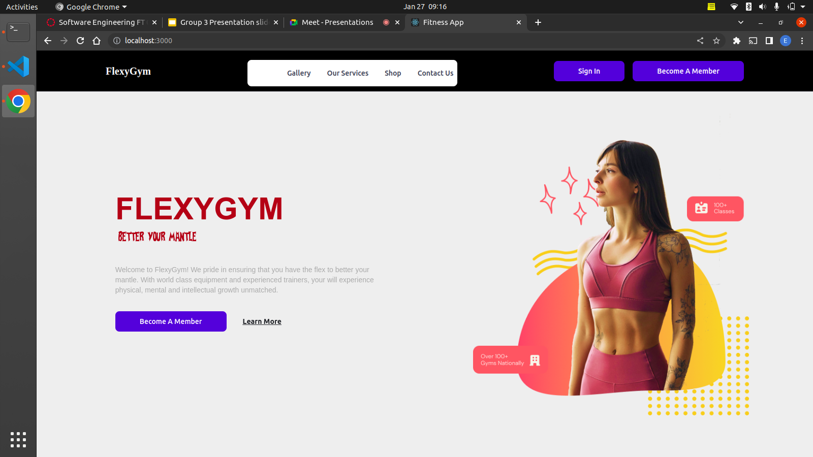

# PHASE II CAPSTONE PROJECT
## FLEX GYM
<h2> About The Project</h2>
<p>This is a React Application that offers users the convenience in booking and subscribing to a fitness program easily online. It also allows users to shop quality sportswear and equipments. It also aims to build a community and drive engagement to give knowledge to people among other features.
</p>
<p>[Fitness App Live Link](https://fitness-app-livid.vercel.app)</p>

<h2>Demo</h2>
<p></p>

---
**Authors and Contributors**
| No  |      Name      |                  Email                   |     Role      |
| :-: | :------------: | :--------------------------------------: | :-----------: |
|  1  | Abdulrahman Omar  | abdu.omar@student.moringaschool.com |   Landing Page       |
|  2  | Emilly Tiampati  | emilly.tiampati@student.moringaschool.com |   Shop and Cart       |
|  3  | Samuel Muthaiga  |samuel.muthaiga@student.moringaschool.com |   Gallery Page      |
|  4  | Justine Limo  | justine.limo@student.moringaschool.com |   Contact Us Page       |
|  5  | Maryann Njuguna  | maryann.njuguna@student.moringaschool.com |   Services Page       |

---
<h3>Built With</h3>
Below is a list of all the technologies used to bootstrap this project.
<ul>
<li> React</li>
<li> CSS3</li>
<li> JavaScript</li>
<li>Bootstrap</li>
<li>Tailwind</li>
</ul>
<h2> Get Started</h2>
Setup and install the project locally by running the steps below:

### Installations

1. Clone the repo to your local machine
   ```sh
   git clone git@github.com:sereyatiampati/Fitness-App.git
   ```

2. Run this command in your terminal to to install dependencies:
   ```sh
      npm install
      ```
3. To get the application running:
   ```sh
      npm start
      ```
4. Install JSON Server globally on your machine by running this command on your terminal:
   ```sh
      npm install -g json-server
      ```
 .Run this command on your terminal to get the backend started::
   ```sh
      json-server --watch db.json
   ````

## License

Distributed under the MIT License. See `LICENSE.txt` for more information.

## Repository
* **Github Project Link** - [Fitness App](https://github.com/sereyatiampati/Fitness-App)

## Acknowledgments

List below are resources used and were helpful and I would like to give credit to.

* [Moringa School](https://moringaschool.com/)
* [BSD 2-Clause "Simplified" License](https://opensource.org/licenses/BSD-2-Clause)
* [React Documentation](https://beta.reactjs.org/learn)
* [Malven Flexbox Cheatsheet](https://flexbox.malven.co/)
* [Malven Grid Cheatsheet](https://grid.malven.co/)
* [Friedman Responsive Web Design Article](https://www.smashingmagazine.com/2011/01/guidelines-for-responsive-web-design/)
* [Font Awesome](https://fontawesome.com)

<p>Copyright © 2023. All rights reserved.</p>